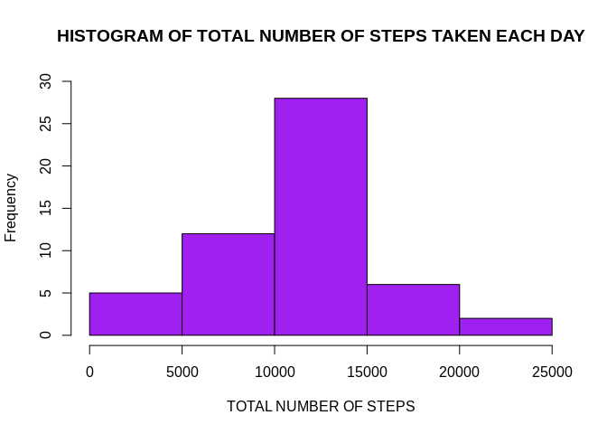
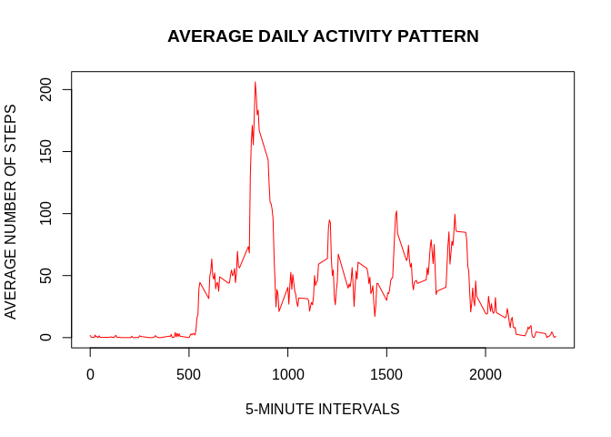
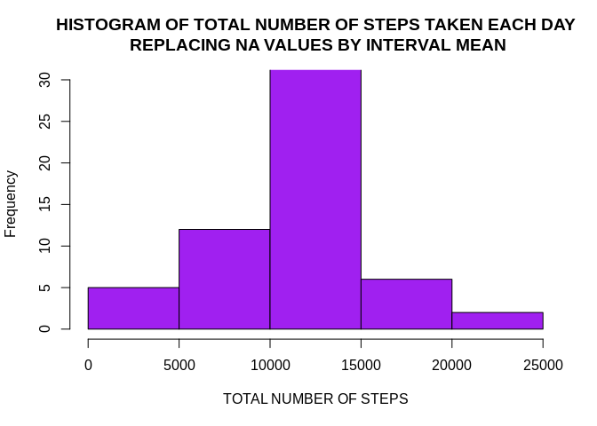
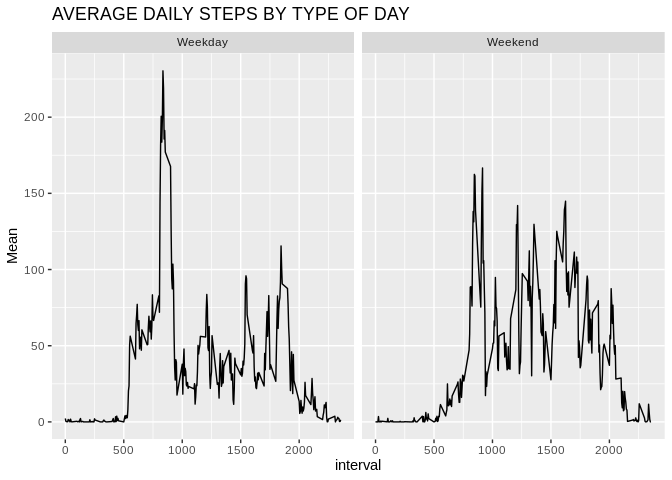

## Initializing packages & reading Data  


```r
library(dplyr)
```

```
## 
## Attaching package: 'dplyr'
```

```
## The following objects are masked from 'package:stats':
## 
##     filter, lag
```

```
## The following objects are masked from 'package:base':
## 
##     intersect, setdiff, setequal, union
```

```r
library(ggplot2)
idat <- read.csv("activity.csv")
```

## Mean total number of steps taken per day:  


```r
##PROCESSING DATA
tab <- summarise(group_by(idat,date), Steps = sum(steps))
```

```
## `summarise()` ungrouping output (override with `.groups` argument)
```

```r
tab <- tab[!is.na(tab$Steps),]
##FIRST PLOT
hist(tab$Steps, ylim = c(0,30), xlab = "TOTAL NUMBER OF STEPS", main = "HISTOGRAM OF TOTAL NUMBER OF STEPS TAKEN EACH DAY", col = "purple")
```

<!-- -->

### Mean and Median of the total number of steps taken per day:  

```r
mean.steps <- mean(tab$Steps)
median.steps <- median(tab$Steps)

mean.steps
```

```
## [1] 10766.19
```

```r
median.steps
```

```
## [1] 10765
```

## Average daily activity pattern:


```r
##SECOND PLOT
tabint <- summarise(group_by(idat,interval), Mean = mean(steps,na.rm = TRUE))
```

```
## `summarise()` ungrouping output (override with `.groups` argument)
```

```r
plot(tabint$interval, tabint$Mean, type = "l", ylab= "AVERAGE NUMBER OF STEPS ", xlab = "5-MINUTE INTERVALS", main = "AVERAGE DAILY ACTIVITY PATTERN", col = "red")
```

<!-- -->


### 5-minute interval, on average across all the days in the dataset, containing the maximum number of steps:


```r
tabint[tabint$Mean == max(tabint$Mean),]
```

```
## # A tibble: 1 x 2
##   interval  Mean
##      <int> <dbl>
## 1      835  206.
```

## Imputing missing values:
### Total number of missing values in the dataset:


```r
##Missing Values
Tot.na <- sum(is.na(idat$steps))
```

## Filling in the Missing Values


```r
newdat <- idat[is.na(idat$steps),]
newdat$steps[] <- tabint$Mean[]
```
### New Dataset with Missing values filled in:

```r
nonnadat <- idat[!is.na(idat$steps),]
fdat <- rbind(newdat,nonnadat) ##New data set
sumdat <- summarise(group_by(fdat,date),Steps = sum(steps)) 
```

```
## `summarise()` ungrouping output (override with `.groups` argument)
```

### Histogram after Imputing


```r
hist(sumdat$Steps, ylim = c(0,30), xlab = "TOTAL NUMBER OF STEPS", main = "HISTOGRAM OF TOTAL NUMBER OF STEPS TAKEN EACH DAY\n REPLACING NA VALUES BY INTERVAL MEAN", col = "purple")
```

<!-- -->

### Mean and Median Total number of steps taken each day after imputing:

```r
mean(sumdat$Steps)
```

```
## [1] 10766.19
```

```r
median(sumdat$Steps)
```

```
## [1] 10766.19
```


## Differences in activity patterns between Weekdays and Weekends:


```r
fdat$date <- as.Date(fdat$date)

fdat$day <- weekdays(fdat$date)

fdat$type <- ifelse(fdat$day == "Saturday" | fdat$day == "Sunday", "Weekend","Weekday")
grouped <- summarise(group_by(fdat,interval,type),Mean = mean(steps))
```

```
## `summarise()` regrouping output by 'interval' (override with `.groups` argument)
```

```r
##Panel Plot
g <- ggplot(grouped, aes(interval,Mean))
g+ geom_line() + facet_grid(.~type) + ggtitle("AVERAGE DAILY STEPS BY TYPE OF DAY")
```

<!-- -->
